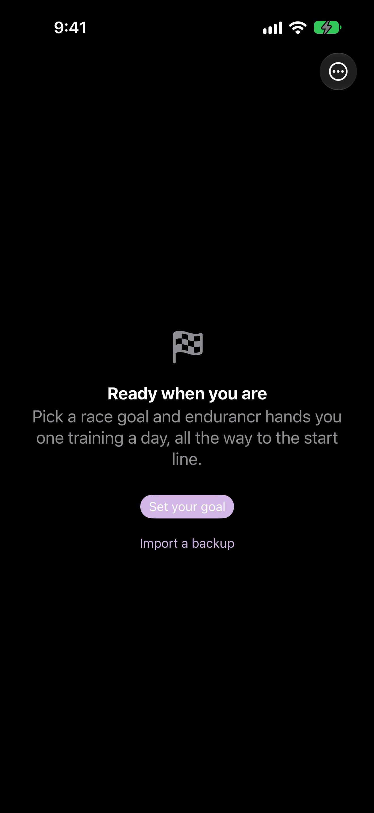
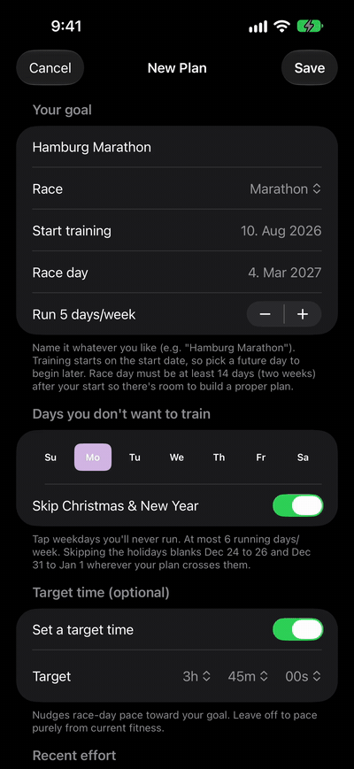
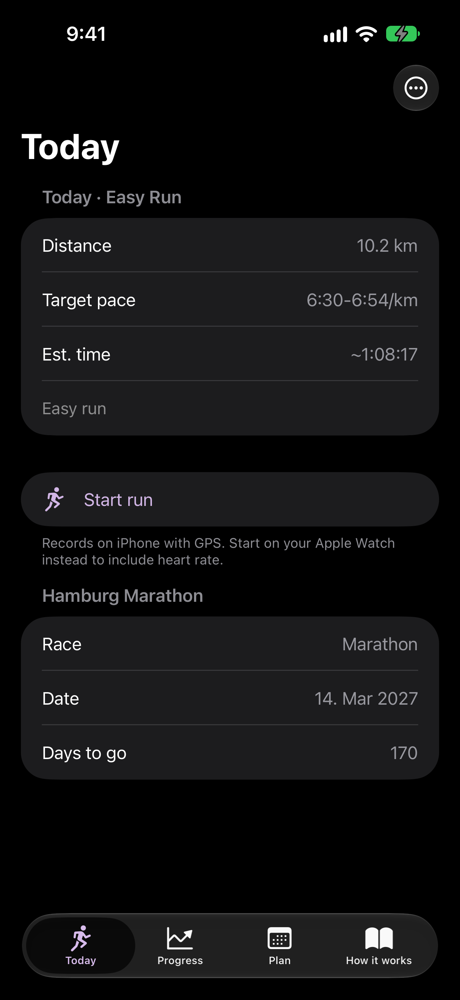
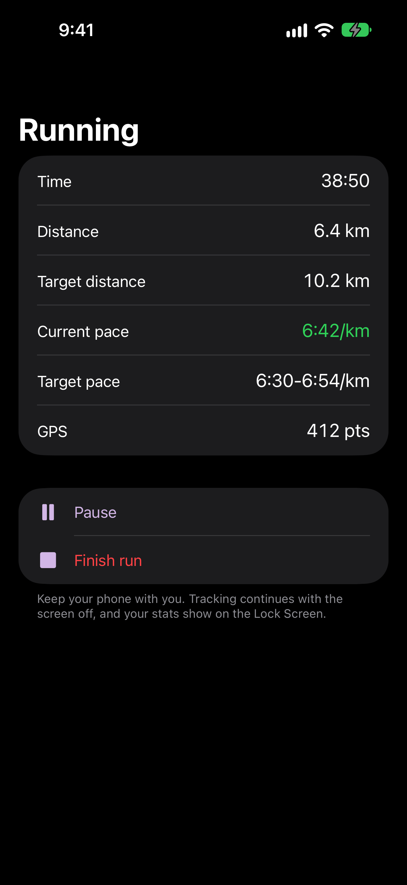
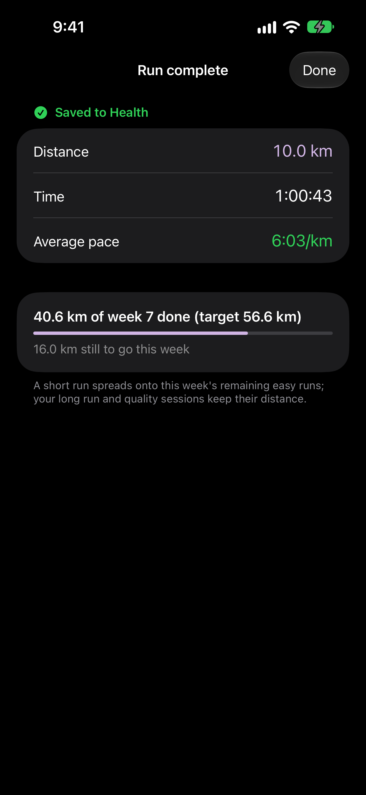
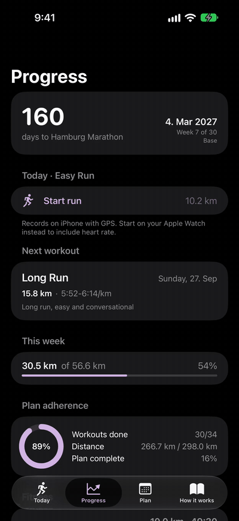
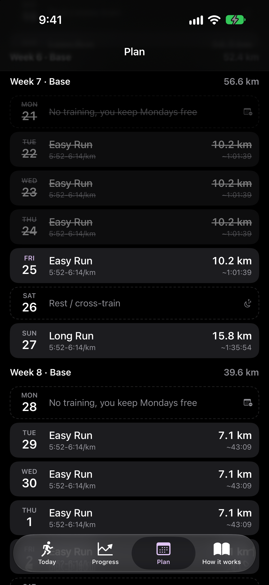
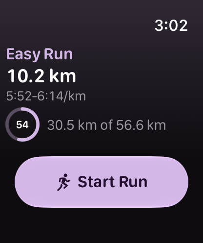
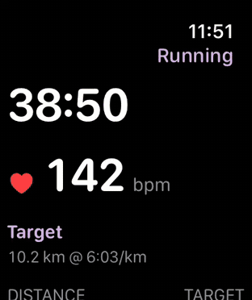
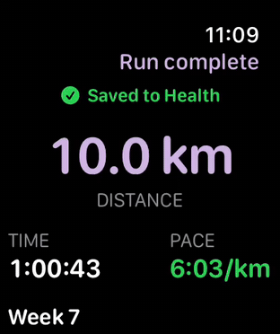

<p align="center">
  
</p>

<h1 align="center">endurancr</h1>

<p align="center">
  Run for you. Not for the feed.<br>
  A private, adaptive running plan for iPhone and Apple Watch.
</p>

<p align="center">
  <a href="https://endurancr.app">endurancr.app</a> ·
  <a href="https://endurancr.app/privacy">Privacy</a> ·
  <a href="LICENSE">MIT License</a>
</p>

---

endurancr builds a training plan around your goal and the pace you actually like,
records your runs on Apple Watch or iPhone, and adapts the plan to what you really
ran. Paces come from the VDOT method by Jack Tupper Daniels.

- **Local only.** No account, no server, no analytics, no ads. The plan is stored on
  your device, and your runs live in Apple Health.
- **Free.** No subscription and no in-app purchases.
- **Open source.** You can read every line that touches your data.

<p align="center">
  
  
  
  
</p>
<p align="center">
  
  
  
</p>
<p align="center">
  
  
  
</p>

## Features

- A goal (for example a marathon on a given date) or a target VDOT, and a plan that
  builds towards it week by week.
- The plan adapts after every run: missed sessions, harder or easier efforts, and
  weekly distance are redistributed while the key sessions stay protected.
- Live run screens on Apple Watch and iPhone, with a Live Activity and controls on
  the Lock Screen.
- The plan syncs directly between iPhone and Apple Watch with WatchConnectivity.
- Backup and import of your plan as a file, only when you choose to share it.

## Project layout

```
TrainingCore/       Plain Swift package: VDOT engine, plan generator, adaptation. Runs anywhere.
Shared/             Code shared by both apps: HealthKit, SwiftData store, plan coordinator.
App-iOS/            iPhone app.
App-iOS-Widgets/    Live Activity extension.
App-watchOS/        Apple Watch app and run recorder.
LiveActivity/       Shared Live Activity attributes and App Intents.
website/            endurancr.app, a static site on Cloudflare Pages.
project.yml         XcodeGen project definition.
```

## Requirements

- Xcode 27 or newer, with the iOS 26 and watchOS 26 SDKs
- Swift 6
- [XcodeGen](https://github.com/yonaskolb/XcodeGen) (`brew install xcodegen`)
- A real iPhone and Apple Watch to test runs, since the Simulator has no heart rate
  or real GPS

## Build

Check the training engine first. It needs no Xcode project:

```sh
cd TrainingCore
swift run TrainingCoreChecks
```

Then generate and open the app project:

```sh
xcodegen generate
open Endurancr.xcodeproj
```

To run it on your own devices, set your own team in `project.yml`
(`DEVELOPMENT_TEAM`) and change the bundle identifiers (`app.endurancr`,
`app.endurancr.widgets`, `app.endurancr.watchkitapp`) to a prefix you own. Then run
`xcodegen generate` again.

## Screenshots and releases

`./scripts/screenshots.sh` takes the screenshots in `docs/screenshots/` on the iPhone and
Apple Watch Simulators, using sample data that only exists in Debug builds
(`Shared/DemoMode.swift`). Long screens are recorded while they scroll and saved as
GIFs (needs ffmpeg). `./scripts/release.sh` raises the build number and archives a
build for TestFlight.

## Privacy

endurancr makes no network requests. It reads and writes workouts, heart rate and
routes in Apple Health only with your permission, and uses location only while you
record a run. Read the full [privacy policy](https://endurancr.app/privacy).

## Contributing

Issues and pull requests are welcome. Please read [CONTRIBUTING.md](CONTRIBUTING.md)
first, and report security problems privately as described in
[SECURITY.md](SECURITY.md).

## License

[MIT](LICENSE) © 2026 Sebastian Käßinger
